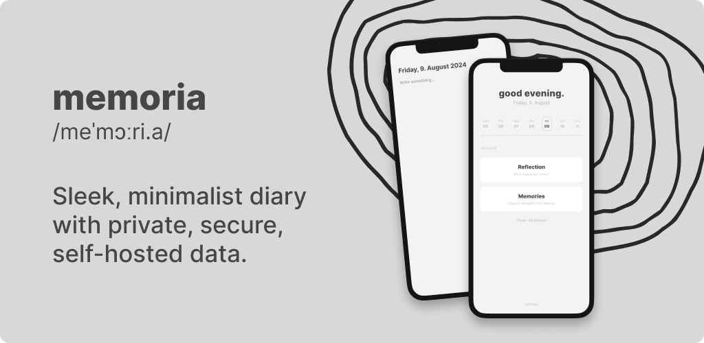

# memoria — private journal

Frustrated with endless subscriptions and the unpredictability of closed-source apps? Longing for a diary that is as private as it is stylish? **memoria** offers a minimalist, modern design where your data remains with you — no analytics, no tracking, and fully self-hostable. You can trust that your diary will stay accessible and secure, thanks to its open-source nature, which ensures that your memories are protected and the app remains reliable over time.

## Installation

<div align="center">
  <a href="#">
    
  </a>
  <a href="#">
    
  </a>
</div>

<br />

With the following steps, you can start **memoria** locally on your own computer:

```
# Clone repository
$ git clone git@github.com:xp4u1/memoria

# Install dependencies
$ yarn

# Start development server
$ yarn dev
```

You can now access **memoria** in your browser at `http://localhost:5173`.

## Synchronization Server

The app supports synchronization with any CouchDB-compatible databases, which can be either self-hosted or rented from a cloud provider.

In the [`./database`](./database) directory, you will find a sample configuration for a Docker installation.

Due to security policies enforced by modern Android and iOS platforms, the database address must meet the requirements for a [secure context](https://developer.mozilla.org/en-US/docs/Web/Security/Secure_Contexts). This means the database must be accessible via a secure web request (HTTPS). Consequently, addresses within a home network are not supported.
